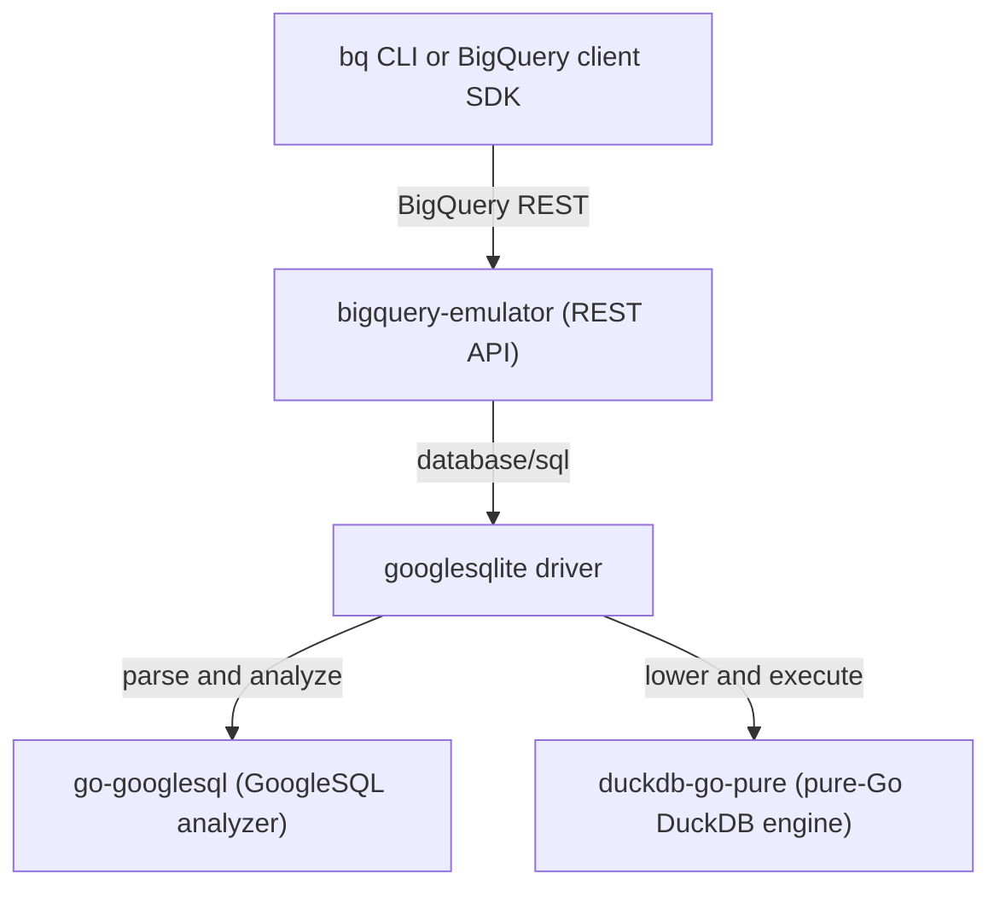

# BigQuery Emulator

> A fork of [goccy/bigquery-emulator](https://github.com/goccy/bigquery-emulator) with the SQL backend swapped to the DuckDB-backed [esilver/googlesqlite](https://github.com/esilver/googlesqlite) engine, running pure-Go (`CGO_ENABLED=0`).

[](https://github.com/esilver/bigquery-emulator/actions/workflows/test.yml)
[](https://github.com/esilver/bigquery-emulator/actions/workflows/integration.yml)
[](https://github.com/sponsors/goccy)

The only open-source emulator for Google BigQuery: a BigQuery-compatible server you run locally for testing and development, with no cloud project or credentials. Pure Go, no cgo, no C toolchain, no wasm runtime. The SQL engine is [googlesqlite](https://github.com/esilver/googlesqlite) - GoogleSQL on a pure-Go DuckDB backend, both transpiled from WebAssembly to Go ahead of time via [wasm2go](https://github.com/ncruces/wasm2go).

# Quick start

The prebuilt image bundles a sample dataset at `/work/sample.yaml`, so `--data-from-yaml` gives you a table to query right away:

```console
$ docker run -it -p 9050:9050 -p 9060:9060 ghcr.io/esilver/bigquery-emulator:latest --project=test --data-from-yaml=/work/sample.yaml
$ bq --api http://0.0.0.0:9050 query --project_id=test "SELECT id, name FROM dataset1.table_a ORDER BY id"
```

The `bq` step needs the [Google Cloud SDK](https://cloud.google.com/sdk/docs/install) on your `PATH`. To stay CLI-free, point any BigQuery client library at `http://0.0.0.0:9050` (see the [Python](#how-to-use-from-python-client) and [Go](#synopsis) examples). On Apple Silicon, add `--platform linux/x86_64` if `docker run` warns about the image platform.

See [Install](#install) for `go install`, prebuilt binaries, packages, and image details, and [How to start the standalone server](#how-to-start-the-standalone-server) for the full option set.

# Features

- **In-process Go tests** - run the emulator via [httptest](https://pkg.go.dev/net/http/httptest), no separate server ([synopsis](#synopsis)).
- **Any other client** - run the static single binary and point the [bq](https://cloud.google.com/bigquery/docs/bq-command-line-tool) CLI or any BigQuery client library at its address.
- **DuckDB-backed `googlesqlite` engine** - storage and query execution. The upstream SQLite-backed build stays available for side-by-side comparison in [BQ Studio](#bq-studio-workbench).
- **YAML seed loader** - load initial data on startup with `--data-from-yaml`.

# Status

**Beta**, but a large part of BigQuery already works from the official client libraries. The multi-client conformance suite ([`test/e2e`](https://github.com/esilver/bigquery-emulator/tree/main/test/e2e)) runs the official Python, Ruby, PHP, Node.js, and Java clients plus the `bq` CLI over a shared query corpus, and passes for every client.

**Is my workload covered?** Coverage is tracked feature by feature in a single matrix, so check two places:

- **[BigQuery feature support matrix](./docs/feature-support.md)** for API-level features. Supported: dataset / table / job / tabledata management, GoogleSQL queries, load and extract jobs (including from Google Cloud Storage), streaming inserts, the gRPC Storage read/write APIs, external tables, and logical and materialized views. Not yet: IAM, row access policies, copy jobs, table snapshots, and BigQuery ML.
- **[googlesqlite status](https://github.com/esilver/googlesqlite#status)** for per-function and per-type SQL coverage, which stays current as the engine evolves.

## GoogleSQL

Query execution runs on [googlesqlite](https://github.com/esilver/googlesqlite). Beyond the per-function coverage in its [status matrix](https://github.com/esilver/googlesqlite#status), the emulator wires up wildcard tables, templated-argument functions, and JavaScript UDFs.

## Benchmarks

Standard analytics suites against the DuckDB-backed engine:

- **TPC-H** - all 22 queries run end to end at scale factor 0.1.
- **ClickBench** - 41 of 43 queries analyze. The other 2 use BigQuery-specific dialect that BigQuery itself rejects, so the emulator rejects them too.

Larger scale factors stream through the load path, so corpus size scales with available disk.

# BQ Studio workbench

[`bq-studio-emulator/`](./bq-studio-emulator/) is a local BigQuery Studio-style UI that fronts both this DuckDB-backed fork and the upstream SQLite-backed build at once: dataset explorer, SQL editor with results grid, CSV loader, and a benchmark tab, with a top-bar backend switch to run the same query against either engine and compare results and timings. Run `cd bq-studio-emulator && docker compose up` (both emulators, the UI, and a shared sample dataset), then open `http://127.0.0.1:5177`. Its [README](./bq-studio-emulator/README.md) covers the manual path and the TPC-H, ClickBench, and NYC Taxi loaders.

# Install

**Docker image** - a multi-arch manifest, so the same tag works on `linux/amd64` and `linux/arm64`:

```console
$ docker pull ghcr.io/esilver/bigquery-emulator:latest
```

CI builds and publishes this image, and tagged releases (`v*`) are built by `build.yml`. The upstream image (SQLite-backed) is `ghcr.io/goccy/bigquery-emulator:latest`.

**Prebuilt binaries and packages** - darwin/linux/windows, amd64/arm64, plus `deb`/`rpm`/`apk`, from [releases](https://github.com/esilver/bigquery-emulator/releases).

**`go install`** - works, but yields the SQLite-backed upstream build, not this fork:

```console
$ go install github.com/goccy/bigquery-emulator/cmd/bigquery-emulator@latest
```

The DuckDB backend is wired through `replace` directives a module-path install cannot reach. To get it, either build from a checkout (`git clone https://github.com/esilver/bigquery-emulator && cd bigquery-emulator && go build ./cmd/...`), or, to import this fork from your own module, keep the `github.com/goccy/...` import paths and add the same two redirects this repo's `go.mod` uses:

```
replace github.com/goccy/googlesqlite => github.com/esilver/googlesqlite v0.0.0-20260613063153-f7765896e410
replace github.com/goccy/go-googlesql => github.com/esilver/go-googlesql v0.2.4-finalizer.1.0.20260611225755-3bdff21371a3
```

These pins advance over time, so match them to the `go.mod` in the checkout you build against.

**Verifying provenance** - the release archives and the container image ship a signed [GitHub build-provenance attestation](https://docs.github.com/en/actions/security-guides/using-artifact-attestations-to-establish-provenance-for-builds). Verify with the GitHub CLI:

```console
# release archive
$ gh attestation verify bigquery-emulator_v0.0.0_linux_amd64.tar.gz --repo esilver/bigquery-emulator

# container image
$ gh attestation verify oci://ghcr.io/esilver/bigquery-emulator:latest --repo esilver/bigquery-emulator
```

# How to start the standalone server

The `bigquery-emulator` CLI takes the following options.

```console
$ ./bigquery-emulator -h
Usage:
  bigquery-emulator [OPTIONS]

Application Options:
      --project=        specify the project name
      --dataset=        specify the dataset name
      --host=           specify the host (default: 0.0.0.0)
      --port=           specify the http port number. this port used by bigquery api (default: 9050)
      --grpc-port=      specify the grpc port number. this port used by bigquery storage api (default: 9060)
      --log-level=      specify the log level (debug/info/warn/error) (default: error)
      --log-format=     specify the log format (console/json) (default: console)
      --database=       specify the database file if required. if not specified, it will be on memory
      --duckdb-max-memory=
                        specify the DuckDB max memory setting (for example 3GB or 3072MB)
      --data-from-yaml= specify the path to the YAML file that contains the initial data
  -v, --version         print version

Help Options:
  -h, --help            Show this help message
```

Start it with a project name, from a binary or the image:

```console
$ ./bigquery-emulator --project=test
[bigquery-emulator] REST server listening at 0.0.0.0:9050
[bigquery-emulator] gRPC server listening at 0.0.0.0:9060

$ docker run -it -p 9050:9050 -p 9060:9060 ghcr.io/esilver/bigquery-emulator:latest --project=test
```

On an M1 Mac with Docker Desktop you may get a platform warning. Add `--platform linux/x86_64`.

## How to use from bq client

### 1. Start the standalone server

```console
$ ./bigquery-emulator --project=test --data-from-yaml=./server/testdata/data.yaml
[bigquery-emulator] REST server listening at 0.0.0.0:9050
[bigquery-emulator] gRPC server listening at 0.0.0.0:9060
```

* `server/testdata/data.yaml` is [here](https://github.com/esilver/bigquery-emulator/blob/main/server/testdata/data.yaml)

### 2. Call endpoint from bq client

```console
$ bq --api http://0.0.0.0:9050 query --project_id=test "SELECT * FROM dataset1.table_a WHERE id = 1"

+----+-------+---------------------------------------------+------------+----------+---------------------+
| id | name  |                  structarr                  |  birthday  | skillNum |     created_at      |
+----+-------+---------------------------------------------+------------+----------+---------------------+
|  1 | alice | [{"key":"profile","value":"{\"age\": 10}"}] | 2012-01-01 |        3 | 2022-01-01 12:00:00 |
+----+-------+---------------------------------------------+------------+----------+---------------------+
```

## How to use from python client

### 1. Start the standalone server

```console
$ ./bigquery-emulator --project=test --dataset=dataset1
[bigquery-emulator] REST server listening at 0.0.0.0:9050
[bigquery-emulator] gRPC server listening at 0.0.0.0:9060
```

### 2. Call endpoint from python client

Set `api_endpoint` on `ClientOptions` and pass `AnonymousCredentials` to disable auth.

```python
from google.api_core.client_options import ClientOptions
from google.auth.credentials import AnonymousCredentials
from google.cloud import bigquery
from google.cloud.bigquery import QueryJobConfig

client_options = ClientOptions(api_endpoint="http://0.0.0.0:9050")
client = bigquery.Client(
  "test",
  client_options=client_options,
  credentials=AnonymousCredentials(),
)
client.query(query="...", job_config=QueryJobConfig())
```

To download results into a DataFrame, either disable the BigQuery Storage client with `create_bqstorage_client=False`, or point one at the local gRPC port (default 9060). See [query results to DataFrame](https://cloud.google.com/bigquery/docs/samples/bigquery-query-results-dataframe?hl=en).

```python
result = client.query(sql).to_dataframe(create_bqstorage_client=False)
```

or

```python
from google.cloud import bigquery_storage

client_options = ClientOptions(api_endpoint="0.0.0.0:9060")
read_client = bigquery_storage.BigQueryReadClient(client_options=client_options)
result = client.query(sql).to_dataframe(bqstorage_client=read_client)
``` 

# Synopsis

From a Go test, run the emulator in the test process itself. Import `github.com/goccy/bigquery-emulator/server` (and `.../types`) and call `server.New` to create the instance. Full API reference: <https://pkg.go.dev/github.com/goccy/bigquery-emulator>.

The `github.com/goccy/...` import paths below are correct, but a module that wants the DuckDB-backed engine still needs the two `replace` directives from [Install](#install) in its own `go.mod`. Without them the imports resolve to the SQLite-backed upstream.

```go
package main

import (
  "context"
  "fmt"

  "cloud.google.com/go/bigquery"
  "github.com/goccy/bigquery-emulator/server"
  "github.com/goccy/bigquery-emulator/types"
  "google.golang.org/api/iterator"
  "google.golang.org/api/option"
)

func main() {
  ctx := context.Background()
  const (
    projectID = "test"
    datasetID = "dataset1"
    routineID = "routine1"
  )
  bqServer, err := server.New(server.TempStorage)
  if err != nil {
    panic(err)
  }
  if err := bqServer.Load(
    server.StructSource(
      types.NewProject(
        projectID,
        types.NewDataset(
          datasetID,
        ),
      ),
    ),
  ); err != nil {
    panic(err)
  }
  if err := bqServer.SetProject(projectID); err != nil {
    panic(err)
  }
  testServer := bqServer.TestServer()
  defer testServer.Close()

  client, err := bigquery.NewClient(
    ctx,
    projectID,
    option.WithEndpoint(testServer.URL),
    option.WithoutAuthentication(),
  )
  if err != nil {
    panic(err)
  }
  defer client.Close()
  routineName, err := client.Dataset(datasetID).Routine(routineID).Identifier(bigquery.StandardSQLID)
  if err != nil {
    panic(err)
  }
  sql := fmt.Sprintf(`
CREATE FUNCTION %s(
  arr ARRAY<STRUCT<name STRING, val INT64>>
) AS (
  (SELECT SUM(IF(elem.name = "foo",elem.val,null)) FROM UNNEST(arr) AS elem)
)`, routineName)
  job, err := client.Query(sql).Run(ctx)
  if err != nil {
    panic(err)
  }
  status, err := job.Wait(ctx)
  if err != nil {
    panic(err)
  }
  if err := status.Err(); err != nil {
    panic(err)
  }

  it, err := client.Query(fmt.Sprintf(`
SELECT %s([
  STRUCT<name STRING, val INT64>("foo", 10),
  STRUCT<name STRING, val INT64>("bar", 40),
  STRUCT<name STRING, val INT64>("foo", 20)
])`, routineName)).Read(ctx)
  if err != nil {
    panic(err)
  }

  var row []bigquery.Value
  if err := it.Next(&row); err != nil {
    if err == iterator.Done {
        return
    }
    panic(err)
  }
  fmt.Println(row[0]) // 30
}
```

# Debugging

If you started `bigquery-emulator` with a database file, inspect it with the tooling for the linked backend. SQLite-backed builds produce ordinary SQLite files, DuckDB-backed builds produce DuckDB database files.

# How it works

## Architecture overview

A GoogleSQL query arrives over the REST API from `bq` or a client SDK. The googlesqlite driver parses and analyzes it with [go-googlesql](https://github.com/esilver/go-googlesql), then lowers and executes it against the embedded backend linked into the build.



## Type conversion flow

BigQuery types like ARRAY and STRUCT do not map 1:1 to local SQL engines. googlesqlite owns the backend-specific encoding, decoding, and native-value bridge that preserve those values through execution.

# Reference

- [How to create a BigQuery Emulator](https://docs.google.com/presentation/d/1j5TPCpXiE9CvBjq78W8BWz-cGxU8djW1qy9Y6eBHso8/edit?usp=sharing) (Japanese) - the story behind the upstream project.

# Sponsorship

`bigquery-emulator` was created and is maintained by [@goccy](https://github.com/goccy) (Masaaki Goshima), who built the only open-source BigQuery emulator to fill a long-standing gap (Google's [emulator request](https://issuetracker.google.com/issues/129248927) has sat open for years). This repository forks that work to swap the SQL backend to DuckDB and run pure-Go. All of the upstream emulator work it builds on is goccy's.

If this project saves you time, please sponsor the upstream author: <https://github.com/sponsors/goccy>.

# License

MIT
